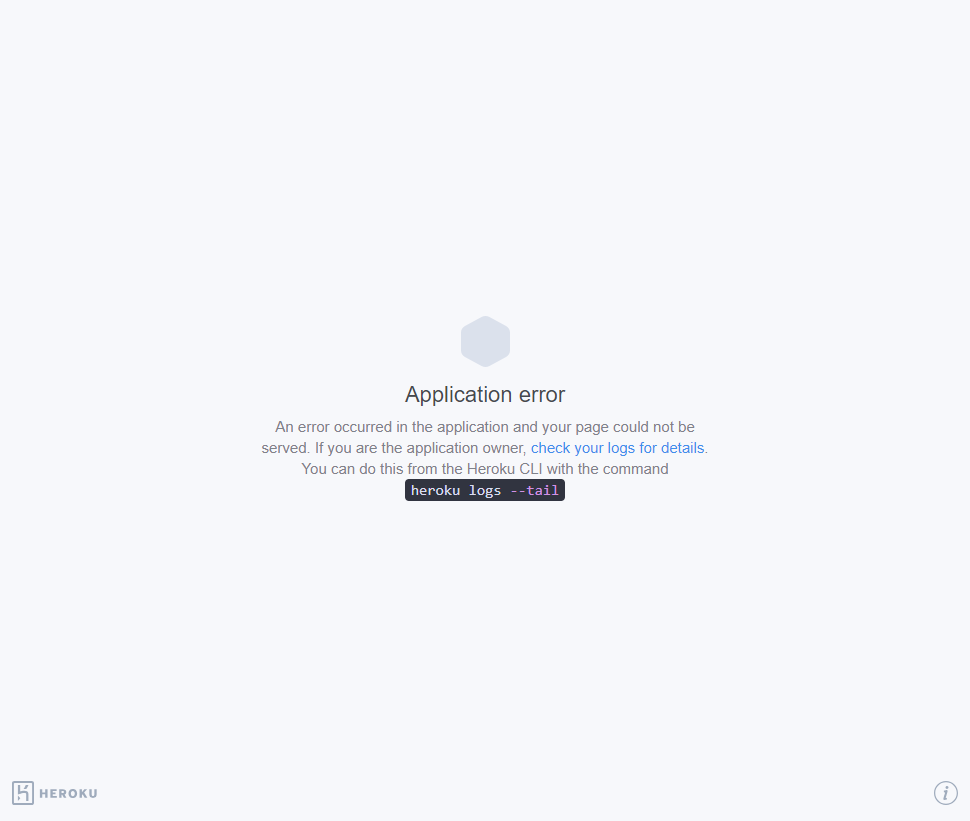

# Text-Editor
### A Single Page In-Browser Text Editor Application
Demonstrating my knowledge of PWAs or Progressive Web Applications, I was tasked with building a single page text editor application that runs in the browser and meets PWA criteria. It additionally features a number of data persistence techniques that serve as redundancy in case one of the options is not supported by the browser. the application is also designed to function offline. The application was built using an existing application and implementing methods for receiving and storing data to an IndexedDB database.The Application is deployed to Heroku.

## Table of Contents
1. [Acceptance Criteria](#acceptance-criteria)
2. [Work Completed](#work-completed)
3. [Work to be Completed](#work-to-be-completed)
4. [Deployed Application URL](#deployed-application-url)
5. [Deployed Application Screenshot](#deployed-application-screenshot)
6. [Credits](#credits)

## Acceptance Criteria
- GIVEN a text editor web application, WHEN I open my application in my editor, THEN I should see a client server folder structure;
- WHEN I run `npm run start` from the root directory, THEN I find that my application should start up the backend and serve the client;
- WHEN I run the text editor application from my terminal, THEN I find that my JavaScript files have been bundled using webpack;
- WHEN I run my webpack plugins, THEN I find that I have a generated HTML file, service worker, and a manifest file;
- WHEN I use next-gen JavaScript in my application, THEN I find that the text editor still functions in the browser without errors;
- WHEN I open the text editor, THEN I find that IndexedDB has immediately created a database storage;
- WHEN I enter content and subsequently click off of the DOM window, THEN I find that the content in the text editor has been saved with IndexedDB;
- WHEN I reopen the text editor after closing it, THEN I find that the content in the text editor has been retrieved from our IndexedDB;
- WHEN I click on the Install button, THEN I download my web application as an icon on my desktop;
- WHEN I load my web application, THEN I should have a registered service worker using workbox;
- WHEN I register a service worker, THEN I should have my static assets pre cached upon loading along with subsequent pages and static assets;
- WHEN I deploy to Heroku, THEN I should have proper build scripts for a webpack application.

## Work Completed
- Added methods for saving and retrieving data from IndexedDB
- Added event handlers and listeners for the application install 
- Implemented asset caching 
- Added and configured workbox plug-ins for a service worker and manifest file
- Added CSS and Babel Loaders for webpack

## Work to be Completed
- Debug code to ensure that the application functions properly in all browsers
- Debug code to prevent application from giving Heroku H10 error
- Creating an Uninstall function
- Creating a Delete function
- Creating a Clear All function

## Deployed Application URL
https://sb-text-editor-544ca693fc9b.herokuapp.com/

## Deployed Application Screenshot
(Currently Displaying a crash on Heroku, Logs show H10 error)

## Credits
Application built/refactored by Sier Behashti Email: Sbehashti@gmail.com Github: https://github.com/sbehashti

Starter Code provided by UC Davis Coding Bootcamp

### Technologies Used
- HTML
- CSS
- JavaScript
- VS Code
- GitHub
- GitBash
- Heroku
- Webpack
- Babel
- Workbox
- IndexedDB
- WebPack
- Node.JS